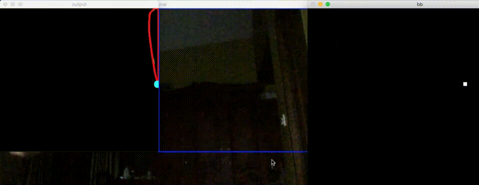

# Hand Motion based blackboard application

## Table of contents
* [General info](#general-info)
* [Technologies](#technologies)
* [Setup](#setup)

## General info
This is a project done as part of  EE5005 Image Processing course. This project is hand gesture based blackboard with features such as multiple colours, edit and erase mode.
	
## Technologies
Project is created with:
* Python
* OpenCV
	
## Setup
To run this project:

```
$ cd ../Hand-Motion-Based-BlackBoard
$ python BlackBoard.py

```
To capture the background use b key in the keyboard \
Project is controlled by following counts of finger:
* 4 fingers- Toggle colours ( Red, Blue, Green and White)
* 3 fingers - Edit mode
* 5 fingers - Erase mode
* Use finger tip to draw and erase